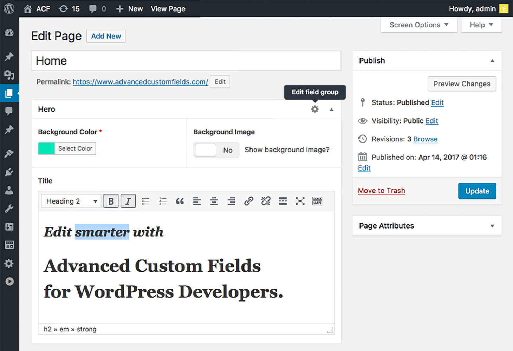
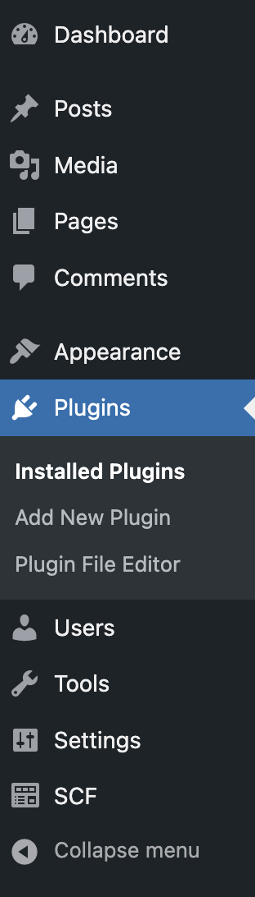
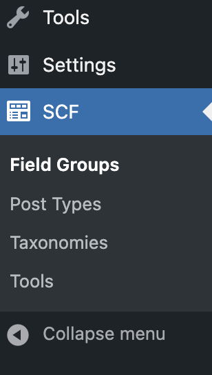
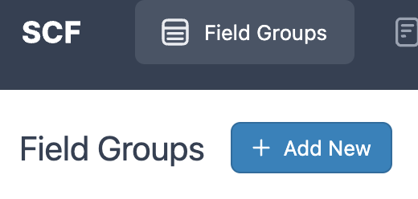
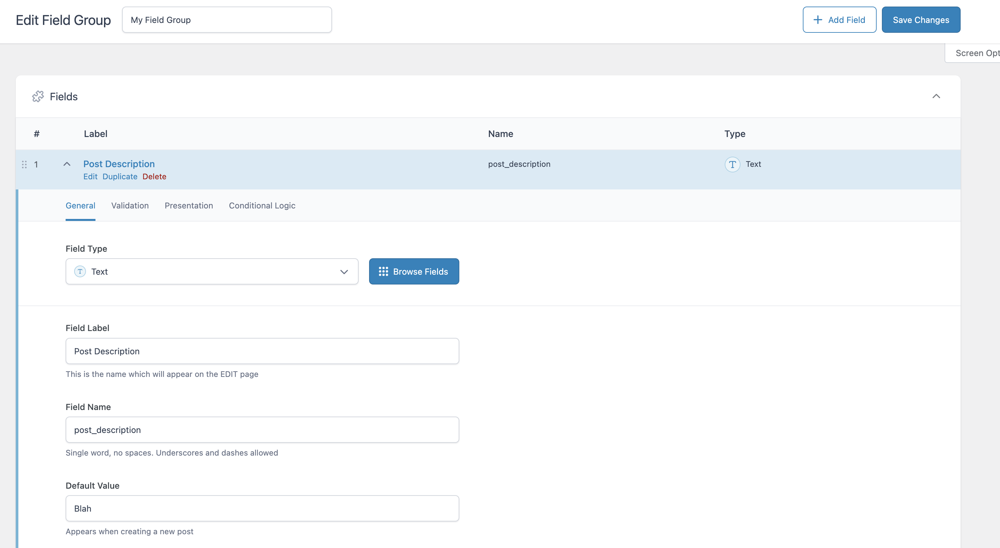
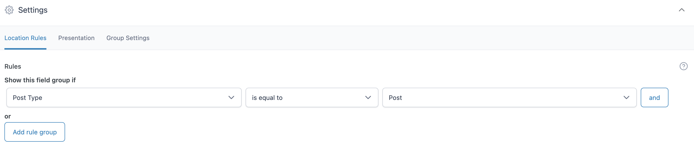
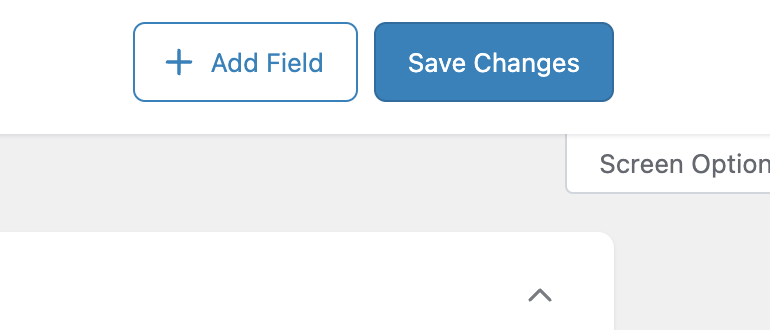
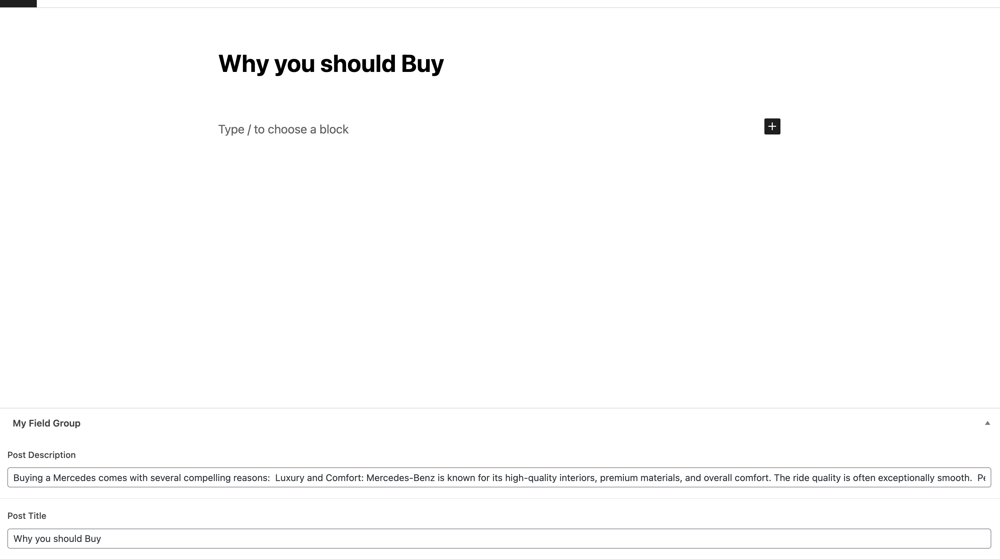
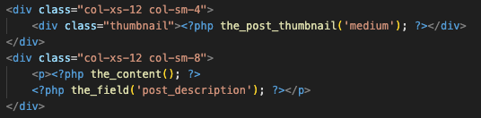

# Installing Advanced Custom Fields Plugin
> [!WARNING]
> Recently Wordpress has taken over the ACF plugin and it has now been renamed to Secure Custom Fields in their plugins catalog. Everything from this tutorial will be based on SCF, however if you want to stick with ACF the download instructions are [here](https://www.advancedcustomfields.com/blog/installing-and-upgrading-to-the-latest-version-of-acf/)

## Introduction
SCF is a fork of the ACF plugin, which allows you to lock down the Wordpress page editor, so that form variables can be used to fill in information.


So for example if you have a home page with a specific layout you wrote with code, you can leave it locked and instad open up variables which can be edited to modify the content of the individual elements without changing the layout.
> [!TIP]
> Good for website design agencies looking to keep the customer from destroying the website.

## Installation Steps
1. Open your Wordpress admin site and select plugins 


- Click add new plugin on the top left


2. Search for Secure Custom Fields and enable it 
- There should now be a new section in your side bar which says SCF



## Dashboard Steps
1. In the SCF Section add a new field group


- Essentially just the certain fields which you can assign to certain pages (Different pages should have different field groups)

2. Give the field group a name

3. Begin adding fields
- You can add as many as you want but I am only going to add a text field named post description. 
- Field Type: The type of field which will be displayed, ranging from text, numbers, emails, colors, etc. Which will have their own validation.
- Field Name: The name you will use to refrence this field in code



4. Scroll down to the settings, and adjust the dropdowns
- This allows you to select which pages will have this field group



5. Save your changes and head over to the pages you applied the field group.


- In my case its any post pages
- Now you should see the fields you made, which you can edit



## Use in code
1. In your php files, you can call ```the_field(string str)```
- pass in the FIELD NAME of the field you want to refrence
- For example:



- Result: 


> [!TIP]
> There are more supported functions however this is the bread and butter. For more info I would refer to the [documentation](https://www.advancedcustomfields.com/resources/)